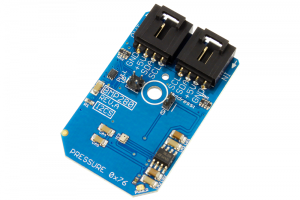

.

# BMP280
BMP280 is a digital pressure Sensor.
This Device is available from www.ncd.io 

[SKU: BMP280_I2CS]

(https://store.ncd.io/product/bmp280-digital-pressure-sensor-300-1100-hpa-i2c-mini-module/)
This Sample code can be used with Arduino.

## Arduino
Hardware needed to interface BMP280 Digital Pressure sensor with Arduino
1. <a href="https://store.ncd.io/product/i2c-shield-for-arduino-nano/">Arduino Nano</a>
2. <a href="https://store.ncd.io/product/i2c-shield-for-arduino-micro-with-i2c-expansion-port/">Arduino Micro</a>
3. <a href="https://store.ncd.io/product/i2c-shield-for-arduino-uno/">Arduino uno</a>
4. <a href="https://store.ncd.io/product/dual-i2c-shield-for-arduino-due-with-modular-communications-interface/">Arduino Due</a>
5. <a href="https://store.ncd.io/product/bmp280-digital-pressure-sensor-300-1100-hpa-i2c-mini-module/">BMP280 Digital Pressure Sensor</a>
6. <a href="https://store.ncd.io/product/i%C2%B2c-cable/">I2C Cable</a>

BMP280:
The BMP280 is an absolute barometric pressure sensor especially designed for mobile applications. The sensor module is housed in an extremely compact 8-pin metal-lid LGA package.

Applications:

• Enhancement of GPS navigation (e.g. time-to-first-fix improvement, dead-reckoning, slope detection)

• Indoor navigation (floor detection, elevator detection)

• Outdoor navigation, leisure and sports applications

• Weather forecast

• Health care applications (e.g. spirometry)

• Vertical velocity indication (e.g. rise/sink speed)

     
## Arduino
Download and install Arduino Software (IDE) on your machine. Steps to install Arduino are provided at:

https://www.arduino.cc/en/Main/Software

Download (or git pull) the code and double click the file to run the program.
Compile and upload the code on Arduino IDE and see the output on Serial Monitor.

How to Use the BMP280 Arduino Library
The BMP280 has a number of settings, which can be configured based on user requirements.

1.Begin transmission:Start the transmission at the BMP280 sensor address by the following command:
     
     Wire.beginTransmission(address);  // start the transmission
     
2.End transmission:End the transmission by the following command:

      error = Wire.endTransmission();  // end the transmission and result is stored in "error" variable
     
3.Value measurement:The following command is used to measure the output value of BMP280 sensor. 

     bmp.Measure_Sensor();  // measure sensor value if the "error" variable is 0
     
4.Operating modes:The BMP280 have three operating modes as following:

  1.Sleep mode
  
  2.Normal mode
  
  3.Forced mode
